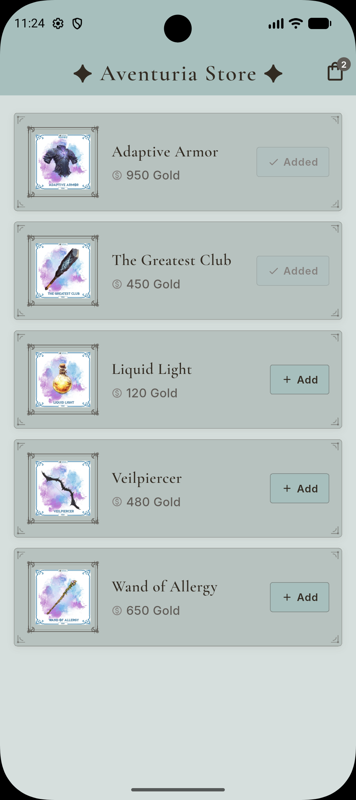
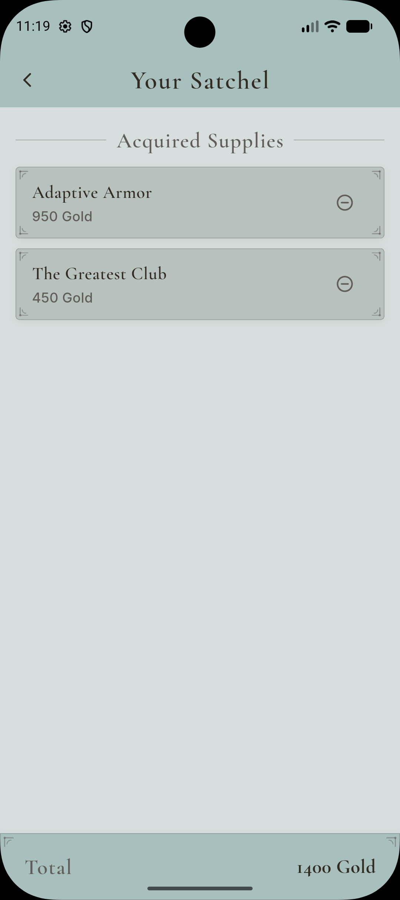

# ⚔️ Aventuria Store — Aplikasi Toko Perlengkapan Petualang

<p align="center">
  Aplikasi mobile berbasis Flutter untuk menjelajahi dan membeli perlengkapan petualangan dengan antarmuka bergaya <em>vintage fantasy</em> yang imersif, ditenagai oleh arsitektur Cubit untuk manajemen state yang bersih dan reaktif.
</p>

<p align="center">
  
  
  
  
</p>

---

## 📋 Deskripsi Proyek

**Aventuria Store** adalah aplikasi e-commerce mini bertema *fantasy RPG* yang dikembangkan menggunakan framework Flutter versi 3.41.7 dengan pola manajemen state **Cubit** dari paket `flutter_bloc`. Aplikasi ini memungkinkan pengguna menelusuri daftar produk perlengkapan petualang, menambahkannya ke dalam "satchel" (keranjang belanja), serta memantau total harga secara *real-time*.

Antarmuka dirancang dengan filosofi *vintage community-driven aesthetic* — menggunakan palet warna muted teal dan warm-grey (`#A7BFBD`, `#322B22`, `#605C57`), tipografi serifal *Cormorant Garamond* untuk judul, serta ornamen sudut dekoratif bergaya klasik pada setiap panel dan kartu produk yang digambar secara programatik menggunakan `CustomPainter`. Setiap produk ditampilkan dengan kartu seni item *ornate fantasy* yang dibingkai ornamen *scroll* dan *fleur* dalam gaya *trading card*.

---

## ✨ Fitur Utama

- **Daftar Produk dengan Kartu Ornamen** — Lima produk perlengkapan petualang ditampilkan dalam kartu dekoratif bergaya vintage dengan bingkai ornamen sudut yang digambar menggunakan `CustomPainter`.
- **Karya Seni Item Fantasi** — Setiap produk menampilkan gambar item *ornate fantasy* di dalam bingkai dekoratif dengan efek latar *watercolour wash* berbasis `RadialGradient`.
- **Tambah ke Keranjang** — Produk dapat ditambahkan ke satchel dengan satu ketukan; tombol berubah menjadi indikator "Added" setelah produk masuk ke keranjang.
- **Hapus dari Keranjang** — Item dalam satchel dapat dihapus secara individual melalui ikon hapus pada setiap baris.
- **Badge Keranjang Real-Time** — Ikon keranjang di AppBar menampilkan badge jumlah item secara reaktif menggunakan `BlocBuilder`, diperbarui setiap kali state `CartCubit` berubah.
- **Layar Satchel** — Menampilkan seluruh item yang telah dibeli beserta nama, harga satuan, dan total keseluruhan dalam panel bergaya vintage.
- **Total Harga Otomatis** — Panel total di bagian bawah layar satchel menghitung dan menampilkan akumulasi harga secara otomatis dari `CartState`.
- **State Kosong Elegan** — Layar satchel menampilkan pesan dekoratif yang terintegrasi dengan estetika vintage ketika keranjang masih kosong.

---

## 🗂️ Struktur Repositori

```
aventuria_store/
├── lib/
│   ├── cubit/
│   │   ├── cart_cubit.dart        # Logika bisnis keranjang (addToCart, removeFromCart)
│   │   └── cart_state.dart        # Definisi CartState yang immutable (part file)
│   ├── models/
│   │   └── product_model.dart     # Model Product + katalog statis kProducts
│   ├── screens/
│   │   ├── product_list_screen.dart  # Layar daftar produk dengan badge dan kartu
│   │   └── cart_screen.dart          # Layar satchel dengan daftar item dan total
│   ├── theme/
│   │   └── app_theme.dart         # AppColors, AppTextStyles, dan ThemeData global
│   ├── widgets/
│   │   ├── decorative_card.dart   # Widget panel dengan ornamen sudut CustomPainter
│   │   └── product_artwork.dart   # Widget bingkai ornate + Image.asset per produk
│   └── main.dart                  # Entry point, inisialisasi BlocProvider
├── assets/
│   ├── fonts/                     # Font Cormorant Garamond & Inter (.ttf)
│   └── images/products/           # Karya seni item fantasy (.png)
├── pubspec.yaml                   # Konfigurasi dependensi dan aset proyek
└── README.md                      # Dokumentasi proyek ini
```

> **Keterangan:**
>
> - `lib/cubit/` — Seluruh logika state management terisolasi di lapisan ini, terpisah penuh dari UI.
> - `lib/widgets/` — Widget dapat-digunakan-ulang (*reusable*) yang tidak bergantung pada state spesifik layar mana pun.
> - `assets/images/products/` — Berisi lima file PNG karya seni item fantasy beresolusi tinggi dengan latar transparan.

---

## 🧩 Penjelasan Arsitektur & Widget

Berikut adalah deskripsi seluruh kelas dan widget yang diimplementasikan dalam aplikasi, mencakup lapisan state management (Cubit), model data, widget kustom, serta komponen UI bawaan Flutter yang berperan krusial.

### Lapisan State Management — Cubit

| Kelas         | Tipe                 | Deskripsi                                                                                                                                                                                                                                                                                                                                                                                   |
| ------------- | -------------------- | ------------------------------------------------------------------------------------------------------------------------------------------------------------------------------------------------------------------------------------------------------------------------------------------------------------------------------------------------------------------------------------------- |
| `CartCubit` | `Cubit<CartState>` | Pusat logika bisnis keranjang belanja. Mewarisi `Cubit<CartState>` dari `flutter_bloc` dan mengekspos dua metode publik: `addToCart(Product)` yang menambahkan produk ke daftar (dengan pengecekan duplikasi via `Product.==`) dan `removeFromCart(Product)` yang menghapusnya. Setiap mutasi memancarkan state baru yang immutable melalui `emit()`.                           |
| `CartState` | `@immutable class` | Objek state yang tidak dapat diubah (*immutable*), didefinisikan sebagai `part` dari `cart_cubit.dart`. Memiliki satu properti `items` berupa `List<Product>` dan getter kalkulasi `totalPrice`. Mengimplementasikan `copyWith()` untuk menciptakan instance baru dari state yang ada, serta `operator ==` berbasis `listEquals` untuk mencegah rebuild yang tidak perlu. |

### Model Data

| Kelas         | Tipe                    | Deskripsi                                                                                                                                                                                                                                                                                                                                        |
| ------------- | ----------------------- | ------------------------------------------------------------------------------------------------------------------------------------------------------------------------------------------------------------------------------------------------------------------------------------------------------------------------------------------------ |
| `Product`   | `@immutable class`    | Cetak biru (*blueprint*) data produk dengan properti `id` (int), `name` (String), `price` (int, dalam Gold), dan `imagePath` (String, path aset gambar). Mengimplementasikan `operator ==` dan `hashCode` berbasis `id` sehingga operasi `List.contains()` dan `List.remove()` di dalam Cubit bekerja secara semantik benar. |
| `kProducts` | `const List<Product>` | Konstanta statis berisi lima produk bawaan toko:*Oak Wood Magic Wand*, *Knight's Iron Axe*, *Basic Defense Spellbook*, *Stamina Recovery Potion*, dan *Silver Flower Ring*. Menjadi sumber data tunggal (*single source of truth*) untuk `ProductListScreen`.                                                                      |

### Konstanta Tema & Gaya

| Kelas             | Tipe                     | Deskripsi                                                                                                                                                                                                                                                                                     |
| ----------------- | ------------------------ | --------------------------------------------------------------------------------------------------------------------------------------------------------------------------------------------------------------------------------------------------------------------------------------------- |
| `AppColors`     | `abstract final class` | Mendefinisikan seluruh konstanta warna aplikasi sebagai `static const Color`. Palet meliputi `darkAccent` (`#322B22`), `headerBg` (`#A7BFBD`), `heading` (`#605C57`), `bodyText` (`#85817E`), `cardBg` (`#B7C2BF`), dan `scaffoldBg` (`#D6DFDD`).                   |
| `AppTextStyles` | `abstract final class` | Mendefinisikan seluruh konstanta gaya teks menggunakan dua family font kustom:`CormorantGaramond` untuk judul dan elemen dekoratif (`appTitle`, `screenHeading`, `productTitle`, `cartTotal`) serta `Inter` untuk elemen fungsional (`price`, `body`, `button`, `badge`). |
| `appTheme`      | `ThemeData`            | Objek `ThemeData` global yang dikonfigurasi dengan `scaffoldBackgroundColor`, `ColorScheme`, dan `AppBarTheme` menggunakan `AppColors` dan `AppTextStyles`, sehingga seluruh layar memperoleh tampilan konsisten tanpa konfigurasi berulang.                                      |

### Widget Kustom (Custom Widget)

| Widget                | Tipe                         | Deskripsi                                                                                                                                                                                                                                                                                                                                                                                                                                                                |
| --------------------- | ---------------------------- | ------------------------------------------------------------------------------------------------------------------------------------------------------------------------------------------------------------------------------------------------------------------------------------------------------------------------------------------------------------------------------------------------------------------------------------------------------------------------ |
| `AventuriaApp`      | `StatelessWidget`          | Widget akar (*root widget*) aplikasi. Membungkus `MaterialApp` di dalam `BlocProvider<CartCubit>` sehingga `CartCubit` tersedia secara global di seluruh pohon widget melalui `context.read<CartCubit>()` dan `context.watch<CartCubit>()`.                                                                                                                                                                                                                  |
| `ProductListScreen` | `StatelessWidget`          | Layar utama aplikasi. Merender `AppBar` dengan judul bertanda `✦` dan aksi `_CartBadge`, serta `ListView.separated` yang menampilkan seluruh `kProducts` melalui widget `_ProductCard`. Tidak menyimpan state lokal; semua reaktivitas ditangani oleh `BlocBuilder` di widget turunannya.                                                                                                                                                                 |
| `CartScreen`        | `StatelessWidget`          | Layar satchel. Menggunakan `BlocBuilder<CartCubit, CartState>` di level `body` untuk menampilkan `_EmptyCart` ketika `state.items` kosong, atau `_CartContent` ketika terdapat item. Total harga ditampilkan di `_TotalPanel` yang terpaku di bagian bawah layar.                                                                                                                                                                                            |
| `DecorativeCard`    | `StatelessWidget`          | Widget panel/kartu yang dapat digunakan ulang sebagai pengganti `Card` bawaan Flutter. Menggunakan `Stack` untuk melapisi konten `child` dengan empat widget `_Ornament` di masing-masing sudut, yang masing-masing berisi `CustomPaint` dengan `_OrnamentPainter` untuk menggambar ornamen sudut klasik. Mendukung kustomisasi `color`, `padding`, `ornamentSize`, dan `borderRadius`.                                                              |
| `ProductArtwork`    | `StatelessWidget`          | Widget seni item produk dengan bingkai ornate. Menggunakan `CustomPaint` dengan `_OrnateFramePainter` untuk menggambar bingkai dua lapis (outer border + inner accent border) dengan ornamen sudut elaborate berupa *bezier curves*, *curl arcs*, dan *tick marks*. Di dalamnya, gambar produk dimuat melalui `Image.asset()` di atas latar `RadialGradient` bergaya *watercolour wash*. Menampilkan ikon *placeholder* jika file aset belum tersedia. |
| `_CartBadge`        | `StatelessWidget` (privat) | Komponen badge keranjang yang diletakkan di `actions` AppBar. Menggunakan `BlocBuilder` dengan `buildWhen` untuk efisiensi — hanya rebuild ketika jumlah `items` berubah. Badge berbentuk lingkaran dengan warna `AppColors.heading` muncul secara kondisional di atas ikon tas.                                                                                                                                                                              |
| `_ProductCard`      | `StatelessWidget` (privat) | Kartu produk tunggal yang terdiri dari `ProductArtwork` (leading), kolom nama + harga (expanded), dan `_VintageButton` (trailing). Menggunakan `BlocBuilder` dengan `buildWhen` terisolasi per produk sehingga hanya kartu yang relevan yang di-rebuild saat state berubah.                                                                                                                                                                                      |
| `_CartItemRow`      | `StatelessWidget` (privat) | Baris item di layar satchel, dibungkus `DecorativeCard`. Menampilkan nama dan harga produk di sisi kiri, serta `IconButton` hapus di sisi kanan yang memanggil `context.read<CartCubit>().removeFromCart(product)`.                                                                                                                                                                                                                                                |
| `_VintageButton`    | `StatelessWidget` (privat) | Tombol aksi bergaya vintage dengan `AnimatedContainer` untuk transisi mulus antara state aktif dan *disabled*. State *disabled* (setelah produk ditambahkan) ditandai dengan opacity berkurang dan label berubah dari "Add" menjadi "Added".                                                                                                                                                                                                                       |

### Komponen CustomPainter

| Painter                                               | Deskripsi                                                                                                                                                                                                                                                                                                                                                |
| ----------------------------------------------------- | -------------------------------------------------------------------------------------------------------------------------------------------------------------------------------------------------------------------------------------------------------------------------------------------------------------------------------------------------------- |
| `_OrnamentPainter` (di `decorative_card.dart`)    | Menggambar ornamen sudut sederhana — dua garis lurus, sebuah `arc` konkaf, dan titik sudut — menggunakan transformasi `canvas.scale` untuk me-mirror ornamen secara akurat ke empat sudut tanpa duplikasi kode.                                                                                                                                    |
| `_OrnateFramePainter` (di `product_artwork.dart`) | Menggambar bingkai dua lapis (*outer* + *accent*) beserta ornamen sudut elaborate yang terdiri dari *scroll arms*, *bezier flourish* konkaf, *curl terminal*, dan *tick marks* dekoratif. Menggunakan `canvas.save()` / `canvas.restore()` dengan transformasi per sudut (`_Corner` enum) untuk konsistensi gambar di semua orientasi. |

### Widget UI Bawaan Flutter yang Krusial

| Widget                                | Peran dalam Aplikasi                                                                                                                                                                                                                                 |
| ------------------------------------- | ---------------------------------------------------------------------------------------------------------------------------------------------------------------------------------------------------------------------------------------------------- |
| `BlocProvider`                      | Menyediakan satu instance `CartCubit` ke seluruh pohon widget dari `main.dart`. Memastikan state keranjang persisten selama sesi aplikasi dan dapat diakses dari layar mana pun melalui `context.read<CartCubit>()`.                           |
| `BlocBuilder<CartCubit, CartState>` | Digunakan di tiga titik:`_CartBadge` (AppBar), kondisi `body` di `CartScreen`, dan tombol tambah di `_ProductCard`. Setiap `BlocBuilder` menggunakan `buildWhen` untuk membatasi scope rebuild seminimal mungkin demi performa optimal.  |
| `CustomPaint`                       | Menjadi tulang punggung sistem ornamen dekoratif. Digunakan di `DecorativeCard` dan `ProductArtwork` untuk menggambar grafis vektor kompleks secara programatik tanpa memerlukan aset gambar eksternal.                                          |
| `AnimatedContainer`                 | Diimplementasikan pada `_VintageButton` untuk memberikan transisi warna dan border yang mulus (durasi 200ms) ketika state tombol berpindah antara aktif dan *disabled* setelah produk ditambahkan ke keranjang.                                  |
| `Stack`                             | Digunakan di dua konteks: (1)`DecorativeCard` untuk melapisi ornamen sudut di atas konten, dan (2) `_CartBadge` untuk menumpangkan badge numerik di atas ikon keranjang.                                                                         |
| `ListView.separated`                | Menampilkan daftar produk di `ProductListScreen` dan daftar item di `CartScreen` dengan `SizedBox(height: 12)` sebagai separator. Lebih efisien dari `Column` untuk daftar yang berpotensi panjang karena hanya merender item yang terlihat. |
| `RadialGradient`                    | Digunakan sebagai latar*watercolour-wash* di dalam bingkai `ProductArtwork`, menciptakan efek pancaran warna teal lembut dari tengah ke tepi yang meniru gaya seni *trading card* fantasi.                                                     |
| `Image.asset`                       | Memuat karya seni item fantasy dari direktori `assets/images/products/`. Dilengkapi `errorBuilder` yang mengembalikan ikon *placeholder* sehingga aplikasi tidak *crash* ketika file gambar belum ditambahkan ke direktori aset.             |
| `Navigator.push`                    | Digunakan pada `_CartBadge` untuk navigasi ke `CartScreen` menggunakan `MaterialPageRoute`. Karena `CartCubit` sudah berada di atas pohon widget, state keranjang tetap terpelihara tanpa perlu injeksi ulang.                               |

---

## 📸 Tampilan Output

<table align="center">
  <tr>
    <td align="center"><b>Daftar Produk</b><br></td>
    <td align="center"><b>Satchel (Keranjang)</b><br></td>
  </tr>
</table>

---

## 🛠️ Prasyarat

Pastikan lingkungan pengembangan telah terpasang dan terkonfigurasi dengan benar:

- [Flutter SDK](https://docs.flutter.dev/get-started/install) versi **3.41.7** atau lebih baru
- [Dart SDK](https://dart.dev/get-dart) versi **3.x** (sudah termasuk dalam Flutter SDK)
- Android Studio / VS Code dengan ekstensi Flutter & Dart
- Perangkat fisik Android atau emulator (API Level 21+)

---

## 🎨 Konfigurasi Aset

### Font Kustom

1. Unduh font dari Google Fonts:
   - [Cormorant Garamond](https://fonts.google.com/specimen/Cormorant+Garamond) — weight 400, 600, 700
   - [Inter](https://fonts.google.com/specimen/Inter) — weight 400, 500, 600, 700
2. Buat direktori `assets/fonts/` di root proyek
3. Letakkan file `.ttf` di dalamnya
4. Hapus tanda komentar pada blok `fonts:` di `pubspec.yaml`

### Gambar Produk

1. Buat direktori `assets/images/products/` di root proyek
2. Tambahkan lima file PNG beresolusi minimum 256×256 px dengan latar transparan:

| Nama File           | Deskripsi Item                                       |
| ------------------- | ---------------------------------------------------- |
| `oak_wand.png`    | Tongkat sihir kayu ek dengan ujung bercahaya         |
| `iron_axe.png`    | Kapak besi tempa dengan ukiran runik                 |
| `spellbook.png`   | Buku mantra berkulit dengan kunci dan pancaran sihir |
| `potion.png`      | Botol elixir stamina dengan cairan berputar          |
| `silver_ring.png` | Cincin perak tipis dengan batu permata motif bunga   |

   Referensi gaya: item melayang di atas percikan *watercolour* pastel, latar transparan, kualitas *trading card* art. Sumber yang disarankan: paket seni gratis di itch.io, atau dihasilkan dengan Midjourney menggunakan prompt `"ornate fantasy [item], watercolour splash, transparent background, trading card art"`.

3. Jalankan `flutter pub get` lalu hot-restart

---

## 🚀 Cara Menjalankan

**1. Clone repositori**

```bash
git clone https://github.com/lauraneval/2311102078_praktikum_abp_02.git
cd pertemuan_11
```

**2. Instal seluruh dependensi**

```bash
flutter pub get
```

**3. Jalankan aplikasi**

```bash
flutter run
```

> Pastikan perangkat/emulator sudah terhubung dan terdeteksi oleh `flutter devices` sebelum menjalankan `flutter run`.

**4. Build APK (opsional)**

```bash
flutter build apk --release
```

---

## 📦 Dependensi

| Package          | Versi      | Fungsi                                                                                                           |
| ---------------- | ---------- | ---------------------------------------------------------------------------------------------------------------- |
| `flutter_bloc` | `^8.1.6` | Menyediakan `Cubit`, `BlocProvider`, dan `BlocBuilder` untuk manajemen state reaktif yang terpisah dari UI |

---

## 📄 Lisensi

Proyek ini dibuat untuk keperluan akademis dalam rangka memenuhi tugas Praktikum Aplikasi Berbasis Platform. Seluruh source code dalam repositori ini bersifat terbuka dan bebas digunakan sebagai referensi pembelajaran.

---

<div align="center">
  <sub>Dibuat dengan ❤️ by Lauraneval · 2026</sub>
</div>
