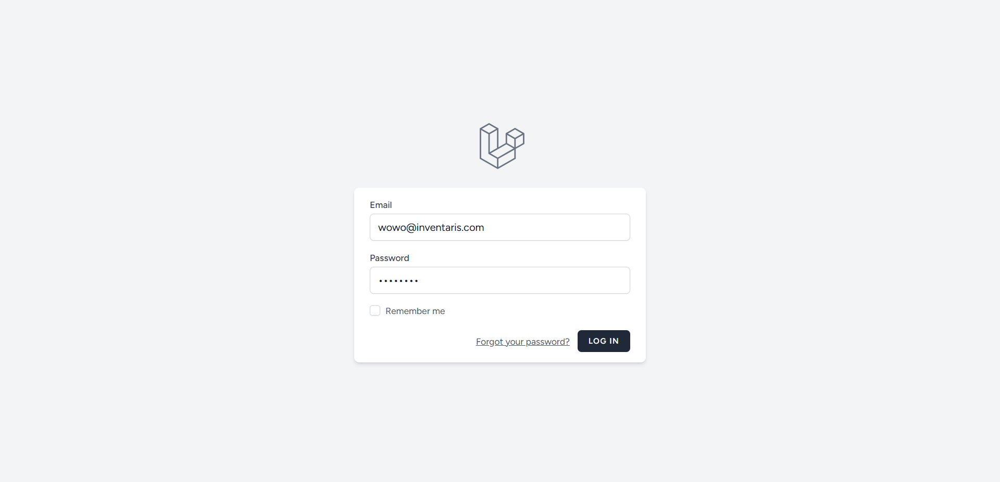
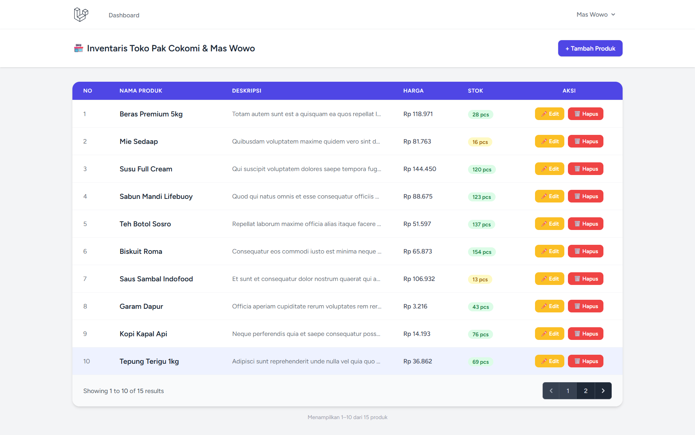
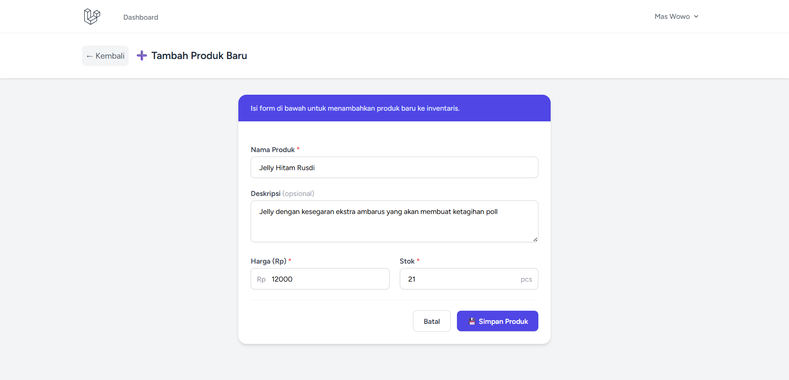
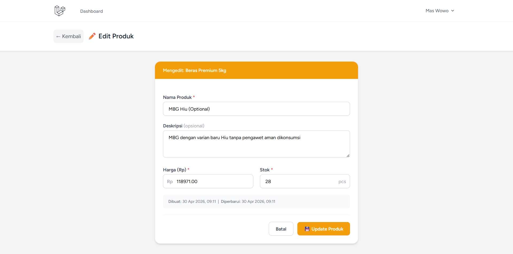
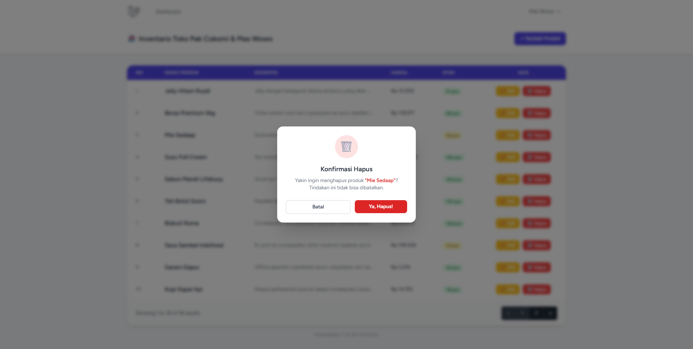
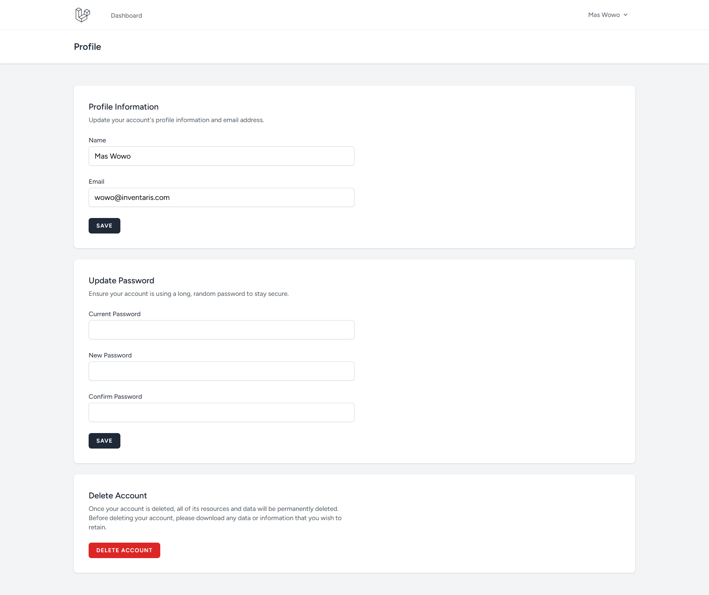

# 🏪 Inventaris Toko — Pak Cokomi & Mas Wowo

> A modern, web-based inventory management system built to streamline Pak Cokomi's shopping experience through a product catalog managed by Mas Wowo.


---

## 📖 Table of Contents

- [Overview](#overview)
- [Screenshots](#screenshots)
- [Features](#features)
- [Tech Stack](#tech-stack)
- [Prerequisites](#prerequisites)
- [Installation & Setup](#installation--setup)
- [Default Credentials](#default-credentials)
- [Project Structure](#project-structure)
- [Available Routes](#available-routes)
- [Database Schema](#database-schema)
- [Development Notes](#development-notes)
- [Contributing](#contributing)
- [License](#license)

---

## Overview

**Inventaris Toko** is a full-stack web application designed for small store inventory management. Built on the Laravel framework with a Blade + Tailwind CSS + Alpine.js frontend stack (via Laravel Breeze), it provides a clean and responsive interface for managing product stock in real time.

The system is role-oriented: **Mas Wowo** manages the inventory through authenticated CRUD operations, while the data is organized to support **Pak Cokomi's** purchasing decisions.

---

## Screenshots

A visual walkthrough of the application's key pages.

### 🔐 Login Page
> Entry point for all users. Authentication is handled securely via Laravel Breeze.



---

### 📦 Dashboard — Product List
> The main inventory table with paginated records, color-coded stock badges, and action buttons.



---

### ➕ Create Product
> A clean, validated form for adding new products to the inventory.



---

### ✏️ Edit Product
> Pre-filled edit form displaying the product's creation and last-updated timestamps.



---

### 🗑️ Delete Confirmation Modal
> Alpine.js-powered confirmation modal to prevent accidental deletions.



---

### 👤 Profile Page
> Built-in profile management page from Laravel Breeze for updating account details.



---

## Features

| Feature | Description |
|---|---|
| 🔐 Authentication | Secure login, registration, and logout powered by Laravel Breeze |
| 📦 Product Listing | Paginated data table with color-coded stock indicators |
| ➕ Add Product | Validated form with real-time error feedback |
| ✏️ Edit Product | Pre-filled form showing creation and last-updated timestamps |
| 🗑️ Delete Product | Confirmation modal via Alpine.js — no accidental deletions |
| 🔔 Flash Notifications | Dismissible success alerts after every CRUD action |
| 🌱 Database Seeding | 15+ auto-generated product records ready on first run |
| 👤 Profile Management | Built-in profile edit and account deletion (Breeze default) |

---

## Tech Stack

| Layer | Technology | Version |
|---|---|---|
| Framework | [Laravel](https://laravel.com) | 12.x |
| Authentication | [Laravel Breeze](https://laravel.com/docs/starter-kits#breeze) | Latest |
| Templating | Blade (Laravel built-in) | — |
| CSS Framework | [Tailwind CSS](https://tailwindcss.com) | 3.x |
| JavaScript | [Alpine.js](https://alpinejs.dev) | 3.x |
| Database | MySQL / MariaDB | ≥ 5.7 |
| Runtime | PHP | ≥ 8.2 |
| Package Manager | Composer + NPM | — |

---

## Prerequisites

Before getting started, ensure your environment has the following installed and configured:

- **PHP** `>= 8.2` with extensions: `pdo_mysql`, `mbstring`, `openssl`, `tokenizer`, `xml`, `ctype`, `bcmath`
- **Composer** `>= 2.x`
- **Node.js** `>= 18.x` and **NPM**
- **MySQL** `>= 5.7` or **MariaDB** `>= 10.3`
- **Git**

---

## Installation & Setup

Follow these steps in order from a fresh clone to a running server.

### 1. Clone the Repository

```bash
git clone https://github.com/your-username/inventaris-toko.git
cd inventaris-toko
```

### 2. Install PHP Dependencies

```bash
composer install
```

### 3. Copy the Environment File

```bash
cp .env.example .env
```

### 4. Generate the Application Key

```bash
php artisan key:generate
```

### 5. Configure the Database

Open `.env` in your editor and update the following values to match your local environment:

```env
DB_CONNECTION=mysql
DB_HOST=127.0.0.1
DB_PORT=3306
DB_DATABASE=inventaris_toko
DB_USERNAME=root
DB_PASSWORD=your_password_here
```

> **Note:** Make sure the database `inventaris_toko` already exists in your MySQL server before the next step. You can create it via phpMyAdmin, TablePlus, or the MySQL CLI:
> ```sql
> CREATE DATABASE inventaris_toko;
> ```

### 6. Run Migrations & Seed the Database

```bash
php artisan migrate --seed
```

This command will:
- Create all required database tables
- Seed **15 dummy product records** via the `ProductFactory`
- Create **1 default user account** for immediate login

### 7. Install Node Dependencies & Build Assets

```bash
npm install
npm run build
```

### 8. Start the Development Server

```bash
php artisan serve
```

Open your browser and navigate to: **[http://127.0.0.1:8000](http://127.0.0.1:8000)**

---

## Default Credentials

The following account is created automatically by the database seeder:

| Field | Value |
|---|---|
| **Name** | Mas Wowo |
| **Email** | `wowo@inventaris.com` |
| **Password** | `password` |

> ⚠️ **Security Notice:** Change these credentials immediately in any staging or production environment.

---

## Project Structure

```
inventaris-toko/
│
├── app/
│   ├── Http/
│   │   └── Controllers/
│   │       ├── ProductController.php       # Handles all CRUD operations for products
│   │       └── Auth/                       # Breeze authentication controllers
│   └── Models/
│       ├── Product.php                     # Product Eloquent model
│       └── User.php                        # User Eloquent model
│
├── database/
│   ├── factories/
│   │   └── ProductFactory.php              # Generates realistic dummy product data
│   ├── migrations/
│   │   ├── ..._create_users_table.php
│   │   └── ..._create_products_table.php   # Products schema definition
│   └── seeders/
│       ├── DatabaseSeeder.php              # Main seeder entry point
│       └── ProductSeeder.php               # Seeds 15 products via factory
│
├── resources/
│   └── views/
│       ├── layouts/
│       │   ├── app.blade.php               # Authenticated layout wrapper
│       │   ├── guest.blade.php             # Guest layout wrapper
│       │   └── navigation.blade.php        # Top navigation bar
│       ├── products/
│       │   ├── index.blade.php             # Product list with data table
│       │   ├── create.blade.php            # Add new product form
│       │   └── edit.blade.php              # Edit existing product form
│       └── auth/                           # Breeze auth views (login, register, etc.)
│
├── routes/
│   ├── web.php                             # Application route definitions
│   └── auth.php                            # Breeze authentication routes
│
├── .env.example                            # Environment variable template
├── composer.json
├── package.json
└── README.md
```

---

## Available Routes

| Method | URI | Route Name | Description | Auth Required |
|---|---|---|---|---|
| `GET` | `/` | — | Redirects to product list | No |
| `GET` | `/dashboard` | `dashboard` | Redirects to product list | Yes |
| `GET` | `/products` | `products.index` | Display all products | Yes |
| `GET` | `/products/create` | `products.create` | Show create product form | Yes |
| `POST` | `/products` | `products.store` | Store a new product | Yes |
| `GET` | `/products/{id}/edit` | `products.edit` | Show edit product form | Yes |
| `PUT/PATCH` | `/products/{id}` | `products.update` | Update a product | Yes |
| `DELETE` | `/products/{id}` | `products.destroy` | Delete a product | Yes |
| `GET` | `/profile` | `profile.edit` | View & edit user profile | Yes |
| `PATCH` | `/profile` | `profile.update` | Update user profile | Yes |
| `DELETE` | `/profile` | `profile.destroy` | Delete user account | Yes |

---

## Database Schema

### `users` table

| Column | Type | Description |
|---|---|---|
| `id` | `bigint` (PK) | Auto-incrementing primary key |
| `name` | `varchar(255)` | User's full name |
| `email` | `varchar(255)` | Unique email address |
| `password` | `varchar(255)` | Bcrypt-hashed password |
| `created_at` | `timestamp` | Record creation timestamp |
| `updated_at` | `timestamp` | Record last-updated timestamp |

### `products` table

| Column | Type | Description |
|---|---|---|
| `id` | `bigint` (PK) | Auto-incrementing primary key |
| `nama_produk` | `varchar(255)` | Product name |
| `deskripsi` | `text` (nullable) | Product description |
| `harga` | `decimal(15,2)` | Product price in IDR |
| `stok` | `integer` | Current stock quantity |
| `created_at` | `timestamp` | Record creation timestamp |
| `updated_at` | `timestamp` | Record last-updated timestamp |

---

## Development Notes

**Hot-reload during development:**
```bash
npm run dev
```

**Reset the database and re-seed from scratch:**
```bash
php artisan migrate:fresh --seed
```

**Run tests (if configured):**
```bash
php artisan test
```

**Clear application cache:**
```bash
php artisan optimize:clear
```

**Stock indicator color thresholds** (defined in `products/index.blade.php`):

| Condition | Color | Meaning |
|---|---|---|
| `stok > 20` | 🟢 Green | Sufficient stock |
| `5 < stok ≤ 20` | 🟡 Yellow | Low stock warning |
| `stok ≤ 5` | 🔴 Red | Critical — restock needed |

---

## Contributing

Contributions are welcome! If you'd like to improve this project:

1. Fork the repository
2. Create a new feature branch: `git checkout -b feature/your-feature-name`
3. Commit your changes: `git commit -m 'feat: add your feature description'`
4. Push to the branch: `git push origin feature/your-feature-name`
5. Open a Pull Request

Please ensure your code follows PSR-12 coding standards and includes appropriate comments.

---

## License

This project is open-sourced under the [MIT License](https://opensource.org/licenses/MIT).

---

<p align="center">
  Built with ❤️ for <strong>Pak Cokomi</strong> &amp; <strong>Mas Wowo</strong>
  <br>
  <sub>Powered by Laravel · Tailwind CSS · Alpine.js</sub>
</p>
