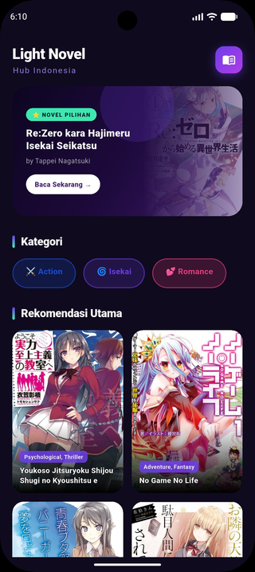
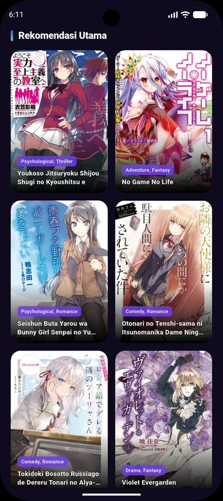
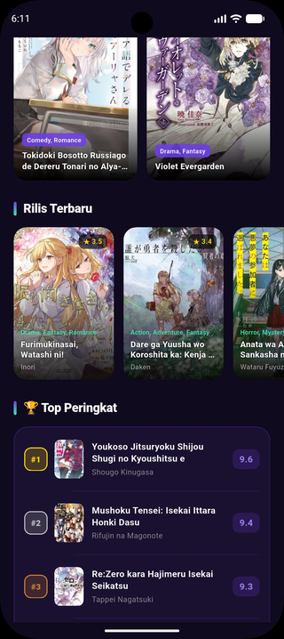
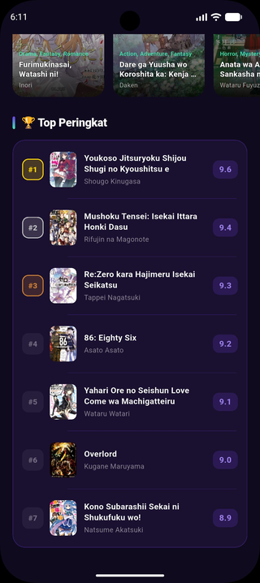

# 📚 Light Novel Hub Indonesia

> Aplikasi mobile berbasis **Flutter** untuk menjelajahi, menemukan, dan menelusuri koleksi light novel populer Jepang. Dibangun dengan desain UI gelap (*dark mode*) yang imersif, menampilkan banner novel pilihan, kategori genre, rekomendasi utama dalam grid, daftar rilis terbaru, hingga peringkat teratas — semuanya dalam satu antarmuka yang elegan dan responsif.

---

## 🖼️ Preview UI

<table>
  <tr>
    <td align="center"><b>Header & Banner Utama</b></td>
    <td align="center"><b>Rekomendasi Utama</b></td>
  </tr>
  <tr>
    <td></td>
    <td></td>
  </tr>
  <tr>
    <td align="center"><b>Rilis Terbaru</b></td>
    <td align="center"><b>Top 7 Peringkat</b></td>
  </tr>
  <tr>
    <td></td>
    <td></td>
  </tr>
</table>

---

## 🚀 Fitur Utama

| Fitur | Deskripsi |
|---|---|
| 🎨 Dark UI | Tema gelap premium dengan palet warna ungu dan gradien |
| 🖼️ Banner Stack | Hero section bertumpuk (Stack) dengan cover novel dari internet |
| 📂 Kategori | Daftar genre horizontal yang dapat di-scroll |
| 🔲 Grid Rekomendasi | Tampilan grid 2 kolom untuk novel-novel pilihan |
| 📜 Rilis Terbaru | Kartu horizontal dinamis menggunakan `ListView.builder` |
| 🏆 Top Peringkat | Daftar vertikal dengan divider rapi via `ListView.separated` |
| 🌐 Image.network | Semua cover novel di-load langsung dari URL |

---

## 🛠️ Implementasi Widget Flutter

Bagian ini menjelaskan secara teknis bagaimana setiap widget utama Flutter diimplementasikan dalam proyek ini.

---

### 1. `Stack` — Banner Novel Pilihan yang Bertumpuk

`Stack` adalah widget yang memungkinkan beberapa child widget ditumpuk secara vertikal (satu di atas yang lain), berbeda dengan `Row` atau `Column` yang menyusun widget secara linear.

**Penggunaan dalam proyek:**
Digunakan pada `_buildBannerStack()` untuk membangun hero section di bagian atas halaman. Terdapat **4 layer** yang ditumpuk:

```dart
Stack(
  children: [
    // Layer 1 – Container gradien sebagai background
    Container( decoration: BoxDecoration(gradient: ...) ),

    // Layer 2 – Image.network cover novel, diposisikan di kanan dengan ShaderMask fade
    Positioned( right: 0, child: ShaderMask( child: Image.network(...) ) ),

    // Layer 3 – Lingkaran dekoratif efek glow semi-transparan
    Positioned( right: 110, top: -30, child: Container(shape: BoxShape.circle) ),

    // Layer 4 – Teks judul, badge, dan tombol "Baca Sekarang" di atas semua layer
    Positioned( left: 0, child: Column( children: [badge, title, button] ) ),
  ],
)
```

> **Kelebihan:** `Stack` + `Positioned` memungkinkan elemen UI seperti teks dan tombol menimpa gambar secara presisi tanpa mengubah flow layout utama.

---

### 2. `Container` — Elemen Styling & Dekorasi

`Container` adalah widget serbaguna yang menggabungkan padding, margin, ukuran, warna, border, gradien, dan bayangan dalam satu widget.

**Penggunaan dalam proyek:**

```dart
// Contoh 1: App bar icon dengan gradien dan rounded corner
Container(
  width: 44,
  height: 44,
  decoration: BoxDecoration(
    gradient: LinearGradient(colors: [Color(0xFF6C3DE8), Color(0xFFB03DE8)]),
    borderRadius: BorderRadius.circular(14),
    boxShadow: [ BoxShadow(color: ..., blurRadius: 12) ],
  ),
  child: Icon(Icons.menu_book_rounded),
)

// Contoh 2: Badge genre novel di dalam GridView
Container(
  padding: EdgeInsets.symmetric(horizontal: 7, vertical: 3),
  decoration: BoxDecoration(
    color: Color(0xFF6C3DE8).withOpacity(0.85),
    borderRadius: BorderRadius.circular(6),
  ),
  child: Text(item['genre']),
)

// Contoh 3: Pembungkus daftar Top Peringkat dengan border ungu
Container(
  decoration: BoxDecoration(
    color: Color(0xFF1A1030),
    borderRadius: BorderRadius.circular(20),
    border: Border.all(color: Color(0xFF6C3DE8).withOpacity(0.3)),
  ),
  child: ListView.separated(...),
)
```

> **Kelebihan:** `Container` menghilangkan kebutuhan widget tambahan seperti `DecoratedBox`, `Padding`, dan `SizedBox` secara terpisah — semua styling dapat dikerjakan dalam satu widget.

---

### 3. `GridView.builder` — Rekomendasi Utama (2 Kolom)

`GridView` menampilkan item-item dalam bentuk tabel 2 dimensi (baris dan kolom). Varian `.builder` hanya merender item yang terlihat di layar, sehingga efisien untuk daftar yang panjang.

**Penggunaan dalam proyek:**

```dart
GridView.builder(
  shrinkWrap: true,                          // Agar bisa hidup di dalam SingleChildScrollView
  physics: NeverScrollableScrollPhysics(),   // Scroll dikelola oleh parent ScrollView
  itemCount: _recommended.length,            // Jumlah item dari list _recommended
  gridDelegate: SliverGridDelegateWithFixedCrossAxisCount(
    crossAxisCount: 2,       // 2 kolom
    mainAxisSpacing: 14,     // Jarak vertikal antar item
    crossAxisSpacing: 14,    // Jarak horizontal antar item
    childAspectRatio: 0.68,  // Rasio lebar:tinggi setiap cell (portrait)
  ),
  itemBuilder: (context, index) {
    final item = _recommended[index];
    return ClipRRect(
      child: Stack(
        children: [
          Image.network(item['imageUrl']),    // Layer 1: Gambar cover
          GradientOverlay(),                  // Layer 2: Gradien gelap di bawah
          PositionedText(item),               // Layer 3: Judul & genre di pojok bawah
        ],
      ),
    );
  },
)
```

> **Kelebihan:** Setiap cell grid menggunakan `Stack` internal lagi sehingga teks genre dan judul bisa di-overlay langsung di atas gambar cover, menciptakan tampilan kartu yang imersif.

---

### 4. `ListView` (Statis) — Kategori Genre Horizontal

`ListView` statis digunakan ketika jumlah item **sudah diketahui dan tetap** pada saat kompilasi. Item didefinisikan langsung dalam properti `children`.

**Penggunaan dalam proyek:**

```dart
final List<Map<String, dynamic>> categories = [
  {'label': '⚔️ Action', 'color': Color(0xFF1A4FDE)},
  {'label': '🌀 Isekai', 'color': Color(0xFF6C3DE8)},
  {'label': '💕 Romance', 'color': Color(0xFFE83D7B)},
];

SizedBox(
  height: 48,
  child: ListView(
    scrollDirection: Axis.horizontal,   // Scroll ke samping (horizontal)
    padding: EdgeInsets.symmetric(horizontal: 20),
    children: categories.map((cat) {
      return Container(
        decoration: BoxDecoration(
          color: cat['color'].withOpacity(0.2),
          borderRadius: BorderRadius.circular(24),
          border: Border.all(color: cat['color'].withOpacity(0.6)),
        ),
        child: Text(cat['label']),
      );
    }).toList(),
  ),
)
```

> **Kapan pakai `ListView` statis?** Ketika jumlah item kecil dan tetap (di sini hanya 3 kategori). Semua child langsung di-render sekaligus — tidak ada overhead lazy loading yang diperlukan.

---

### 5. `ListView.builder` — Rilis Terbaru (Dinamis)

`ListView.builder` adalah varian **lazy-loading** dari `ListView`. Widget hanya dibuat saat benar-benar akan terlihat di layar, menjadikannya pilihan terbaik untuk daftar dengan banyak item yang datang dari sumber data dinamis (array, API, database).

**Penggunaan dalam proyek:**

```dart
SizedBox(
  height: 220,
  child: ListView.builder(
    scrollDirection: Axis.horizontal,
    padding: EdgeInsets.symmetric(horizontal: 20),
    itemCount: _newReleases.length,          // Panjang array ditentukan saat runtime
    itemBuilder: (context, index) {
      final novel = _newReleases[index];     // Ambil data berdasarkan index
      return Container(
        width: 145,
        child: Stack(
          children: [
            Image.network(novel['imageUrl']), // Cover dari URL
            RatingBadge(novel['rating']),     // Badge bintang di pojok kanan atas
            NovelInfoBottom(novel),           // Judul, genre, author di bawah
          ],
        ),
      );
    },
  ),
)
```

**Perbandingan efisiensi:**

| Aspek | `ListView` (statis) | `ListView.builder` |
|---|---|---|
| Pembuatan widget | Semua sekaligus | Hanya yang tampil |
| Cocok untuk | Item sedikit & tetap | Item banyak & dinamis |
| Performa | Cukup untuk < 10 item | Optimal untuk ratusan item |
| Data source | `children: [...]` | `itemBuilder` + `itemCount` |

---

### 6. `ListView.separated` — Top Peringkat dengan Divider

`ListView.separated` adalah varian `ListView.builder` yang secara otomatis menyisipkan widget **separator** (pemisah) di antara setiap dua item. Widget ini menghilangkan kebutuhan untuk menambahkan divider secara manual di dalam setiap item builder.

**Penggunaan dalam proyek:**

```dart
ListView.separated(
  shrinkWrap: true,
  physics: NeverScrollableScrollPhysics(),
  itemCount: _topRanked.length,
  
  // Widget pemisah yang disisipkan OTOMATIS antar setiap item
  separatorBuilder: (context, index) => Divider(
    color: Color(0xFF6C3DE8).withOpacity(0.2),
    thickness: 1,
    indent: 86,      // Dimulai setelah badge rank & thumbnail
    endIndent: 16,
  ),
  
  // Widget setiap item (baris peringkat)
  itemBuilder: (context, index) {
    final novel = _topRanked[index];
    return Padding(
      padding: EdgeInsets.symmetric(horizontal: 14, vertical: 10),
      child: Row(
        children: [
          RankBadge(novel['rank']),           // #1, #2, #3, dst
          ThumbnailImage(novel['imageUrl']),   // Cover kecil 42×56px
          TitleAndAuthor(novel),              // Judul & penulis
          ScoreBadge(novel['score']),         // Badge skor (9.6, 9.4, dst)
        ],
      ),
    );
  },
)
```

> **Kelebihan `ListView.separated` vs manual divider:** Separator dikelola sepenuhnya oleh Flutter — tidak perlu kondisi `if (index != last)` untuk menghindari divider di item terakhir. Flutter secara otomatis tidak menyisipkan separator setelah item terakhir.

---

## 📁 Struktur Proyek

```
root/
├── lib/
│   └── main.dart          # Seluruh kode aplikasi (single-file architecture)
├── output/
│   ├── head.png           # Screenshot header & banner
│   ├── recommendation.png # Screenshot grid rekomendasi
│   ├── recent.png         # Screenshot rilis terbaru
│   └── top.png            # Screenshot top peringkat
├── pubspec.yaml
└── README.md
```

---

## ⚙️ Cara Menjalankan

**Prasyarat:** Flutter SDK ≥ 3.0 & Dart ≥ 3.0 terinstal.

```bash
# 1. Clone repositori
git clone https://github.com/lauraneval/2311102078_praktikum_abp_02.git
cd pertemuan_7

# 2. Install dependensi
flutter pub get

# 3. Jalankan aplikasi
flutter run
```

> Pastikan perangkat atau emulator terhubung. Aplikasi membutuhkan koneksi internet untuk memuat gambar cover dari AniList CDN.

---

## 🔧 Dependensi

| Package | Versi | Kegunaan |
|---|---|---|
| `flutter` | SDK | Framework utama |
| `material` (built-in) | — | Komponen UI Material Design 3 |

Tidak ada dependensi pihak ketiga — proyek ini murni menggunakan Flutter core widgets.

---

## 📄 Lisensi

Proyek ini dibuat untuk keperluan akademis. Data novel (judul, penulis, gambar cover) bersumber dari [AniList](https://anilist.co) dan merupakan hak milik pemilik masing-masing.

---

<div align="center">
  <sub>Dibuat dengan ❤️ by Lauraneval · 2026</sub>
</div>