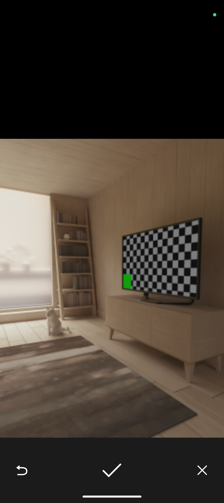
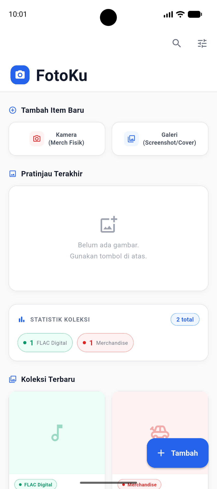
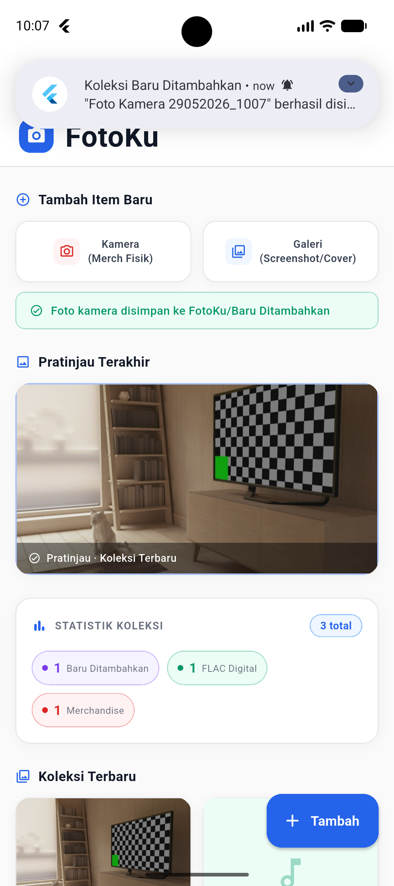
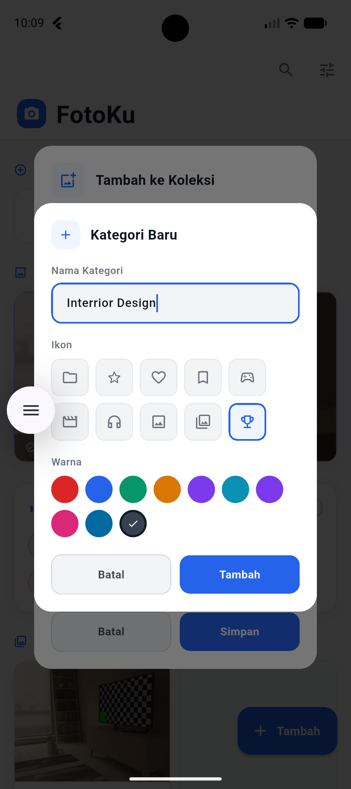
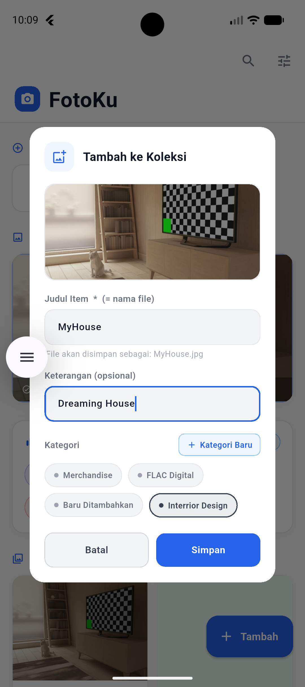
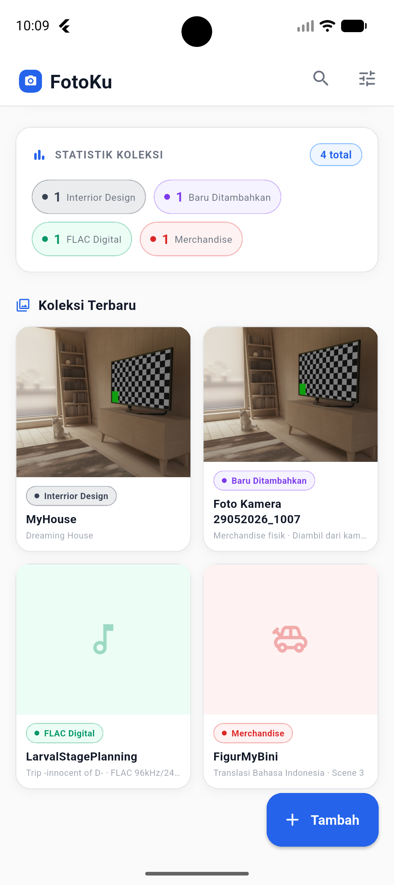
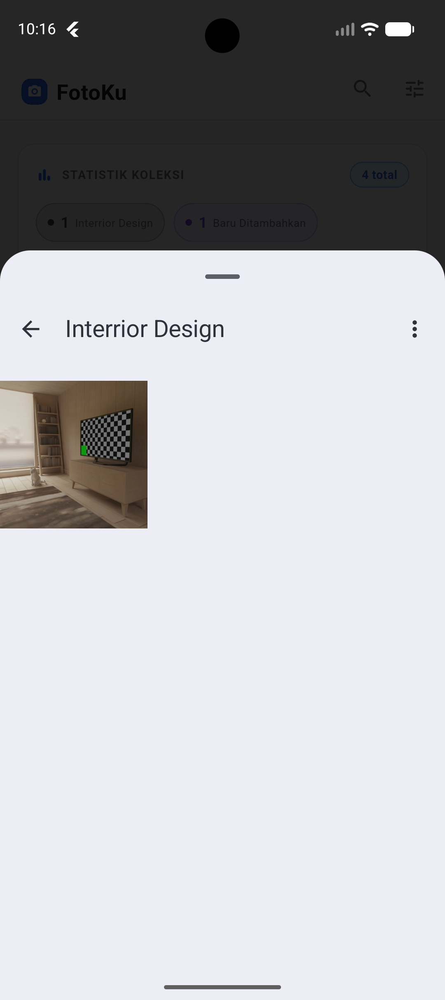

# 📷 FotoKu — Aplikasi Manajemen Koleksi Foto

<p align="center">
  Aplikasi mobile berbasis Flutter untuk mengelola, mengkatalogkan, dan mengarsipkan koleksi foto pribadi secara terstruktur berdasarkan kategori yang dapat dikustomisasi.
</p>

<p align="center">
  
  
  
  
</p>

---

## 📋 Deskripsi Proyek

**FotoKu** adalah aplikasi manajemen koleksi foto yang dikembangkan menggunakan framework Flutter dengan pendekatan *single-file architecture*. Aplikasi ini memungkinkan pengguna untuk menangkap gambar melalui kamera perangkat maupun memilih gambar dari galeri, kemudian menyimpannya secara terorganisir ke dalam kategori-kategori yang dapat dikelola secara mandiri. Setiap item koleksi tersimpan secara persisten di penyimpanan eksternal perangkat dan disinkronisasi ke galeri sistem.

Antarmuka aplikasi dirancang dengan filosofi *clean light-mode design* menggunakan palet warna profesional berbasis biru (`#2563EB`) yang memberikan kesan minimalis, modern, dan mudah digunakan.

---

## ✨ Fitur Utama

- **Ambil Foto via Kamera** — Membuka kamera native perangkat secara langsung menggunakan package `image_picker` untuk mendokumentasikan item koleksi fisik.
- **Pilih Foto dari Galeri** — Mengakses galeri foto perangkat untuk menambahkan gambar digital, screenshot, atau cover album ke dalam koleksi.
- **Manajemen Kategori Dinamis** — Pengguna dapat membuat kategori baru dengan nama, ikon, dan warna yang dapat dikustomisasi secara bebas.
- **Dialog Tambah Koleksi** — Formulir interaktif untuk mengisi judul item, keterangan, serta memilih kategori sebelum menyimpan foto.
- **Penyimpanan Persisten & Terstruktur** — File gambar disimpan secara otomatis ke direktori `Pictures/FotoKu/<NamaKategori>/` di penyimpanan eksternal perangkat Android.
- **Sinkronisasi ke Galeri Sistem** — Memanfaatkan package `gal` untuk mendaftarkan file yang tersimpan ke media store sistem agar muncul di galeri bawaan perangkat.
- **Notifikasi Lokal Otomatis** — Setelah foto berhasil ditambahkan, aplikasi secara otomatis menampilkan notifikasi lokal menggunakan `flutter_local_notifications` sebagai konfirmasi kepada pengguna.
- **Pratinjau Foto Terakhir** — Area pratinjau di halaman utama menampilkan foto yang paling baru ditambahkan dengan transisi animasi *fade-in*.
- **Statistik Koleksi** — Menampilkan ringkasan jumlah item per kategori dalam bentuk chip berwarna yang dinamis.
- **Grid Koleksi Visual** — Semua item koleksi ditampilkan dalam tata letak grid dua kolom yang rapi dengan kartu yang memuat gambar, badge kategori, judul, dan keterangan.

---

## 🗂️ Struktur Repositori

```
fotoku-flutter/
├── lib/
│   └── main.dart              # Source code utama aplikasi (single-file)
├── output/
│   ├── camera.png             # Screenshot tampilan kamera
│   ├── home.png               # Screenshot halaman utama (kosong)
│   ├── notification.png       # Screenshot notifikasi lokal
│   ├── kategori.png           # Screenshot dialog kategori baru
│   ├── koleksi.png            # Screenshot dialog tambah koleksi
│   ├── home-koleksi.png       # Screenshot halaman utama berisi koleksi
│   └── gallery.png            # Screenshot tampilan galeri/grid item
├── pubspec.yaml               # Konfigurasi dependensi proyek
└── README.md                  # Dokumentasi proyek ini
```

> **Keterangan:**
> - `lib/main.dart` — Berisi seluruh logika bisnis, model data, dan komponen UI dalam satu file.
> - `output/` — Berisi tangkapan layar (*screenshot*) hasil pengujian aplikasi yang berjalan pada perangkat fisik/emulator.

---

## 🧩 Penjelasan Widget

Berikut adalah deskripsi widget-widget utama yang diimplementasikan dalam aplikasi, mencakup widget kustom (*custom widget*) maupun widget bawaan Flutter yang berperan krusial dalam membangun antarmuka dan logika aplikasi.

### Widget Kustom (Custom Widget)

| Widget | Tipe | Deskripsi |
|---|---|---|
| `FotoKuApp` | `StatelessWidget` | Widget akar (*root widget*) aplikasi yang mengonfigurasi `MaterialApp` secara menyeluruh, termasuk penetapan tema global (*light mode*, skema warna biru profesional, `ThemeData`, `InputDecorationTheme`) serta penetapan rute awal ke `HalamanUtama`. |
| `HalamanUtama` | `StatefulWidget` | Halaman utama aplikasi yang mengelola seluruh state kritis: file gambar aktif (`_imageFile`), status muat (`_sedangMemuat`), pesan status (`_pesanStatus`), dan daftar koleksi (`_koleksi`). Widget ini juga mengimplementasikan `SingleTickerProviderStateMixin` untuk mendukung `AnimationController` pada animasi pratinjau gambar. |
| `DialogTambahKoleksi` | `StatefulWidget` | Dialog modal interaktif yang ditampilkan setelah pengguna memilih gambar dari galeri. Mengelola dua `TextEditingController` (untuk judul dan keterangan), daftar kategori yang tersedia, serta kategori yang sedang dipilih. Dialog ini juga dapat membuka `DialogKategoriBaru` secara bersarang (*nested dialog*). |
| `DialogKategoriBaru` | `StatefulWidget` | Dialog modal untuk membuat kategori koleksi baru. Menyediakan input nama kategori, grid pemilihan ikon (10 opsi), dan grid pemilihan warna (10 palet warna terstandarisasi). Hasil seleksi dikembalikan ke pemanggil melalui `Navigator.pop()` dalam bentuk objek `KategoriKoleksi`. |

### Model Data

| Kelas | Tipe | Deskripsi |
|---|---|---|
| `KategoriKoleksi` | Data Class | Merepresentasikan sebuah kategori koleksi dengan properti `nama`, `ikon` (`IconData`), `warna`, `warnaBg`, dan flag `isCustom`. Menyediakan factory getter statis (`merchandise`, `coverCD`, `baru`) sebagai kategori bawaan (*default*). |
| `ItemKoleksi` | Data Class | Merepresentasikan satu item koleksi dengan properti `judul`, `subjudul`, `kategori`, `imagePath`, `isFile`, dan `tanggal`. Properti `isFile` digunakan untuk membedakan item dengan gambar nyata dari item *dummy* berupa ikon *placeholder*. |
| `FC` | Utility Class | Kelas palet warna statis (*color palette*) yang mendefinisikan seluruh konstanta warna aplikasi, mulai dari warna latar belakang, teks, border, aksen, hingga warna per kategori beserta versi latar belakangnya yang diredam. |

### Widget UI Bawaan Flutter yang Krusial

| Widget | Deskripsi Peran dalam Aplikasi |
|---|---|
| `CustomScrollView` + `SliverAppBar` | Digunakan di `HalamanUtama` untuk mengimplementasikan *collapsible app bar* yang menciut saat pengguna menggulir konten ke bawah, menciptakan pengalaman navigasi yang halus dan modern. |
| `SliverGrid` | Menampilkan seluruh item koleksi dalam tata letak grid dua kolom yang responsif di bawah konten statis halaman utama, dengan `SliverGridDelegateWithFixedCrossAxisCount` sebagai pengatur proporsi kartu. |
| `AnimationController` + `FadeTransition` | Digunakan untuk menganimasikan kemunculan gambar pratinjau dengan transisi *fade-in* yang halus setiap kali foto baru berhasil ditambahkan ke koleksi. |
| `AnimatedContainer` | Diimplementasikan pada chip kategori di dalam `DialogTambahKoleksi` dan grid ikon di `DialogKategoriBaru` untuk memberikan transisi visual yang mulus saat pengguna berpindah pilihan. |
| `Dialog` + `SingleChildScrollView` | Membungkus formulir di `DialogTambahKoleksi` agar dapat digulir secara vertikal, mencegah *overflow* pada layar perangkat kecil atau saat *soft keyboard* muncul. |
| `TextField` + `TextEditingController` | Digunakan pada dialog tambah koleksi dan dialog kategori baru untuk menerima masukan teks dari pengguna. `addListener` ditambahkan pada kontroler judul untuk memperbarui pratinjau nama file secara *real-time*. |
| `Wrap` | Digunakan untuk menampilkan chip kategori, grid ikon, dan grid warna yang secara otomatis menyesuaikan jumlah kolom berdasarkan lebar layar tanpa memerlukan kalkulasi manual. |
| `GestureDetector` | Membungkus tombol-tombol kustom (tombol aksi kamera/galeri, tombol batal/simpan, chip pilihan) yang tidak menggunakan widget tombol bawaan Material, sehingga interaksi sentuh dapat ditangani secara fleksibel. |
| `ClipRRect` | Digunakan untuk memotong sudut gambar pratinjau di dalam `DialogTambahKoleksi` agar sesuai dengan nilai `BorderRadius` yang ditetapkan, menghasilkan tampilan kartu gambar yang rapi dan konsisten. |
| `Image.file` | Menampilkan gambar dari path file lokal yang tersimpan di penyimpanan perangkat. Digunakan baik di area pratinjau halaman utama maupun di dalam kartu-kartu grid koleksi dan dialog. |
| `FloatingActionButton.extended` | Tombol aksi mengambang di pojok kanan bawah halaman utama yang berfungsi sebagai pintasan cepat untuk membuka galeri dan menambahkan item koleksi baru. |
| `ScaffoldMessenger` + `SnackBar` | Digunakan untuk menampilkan pesan validasi singkat di bagian bawah layar ketika pengguna mencoba menyimpan formulir dengan kolom yang belum terisi. |

---

## 📸 Tampilan Output

<table align="center">
  <tr>
    <td align="center"><b>Kamera</b><br></td>
    <td align="center"><b>Home</b><br></td>
    <td align="center"><b>Notifikasi</b><br></td>
  </tr>
  <tr>
    <td align="center"><b>Kategori Baru</b><br></td>
    <td align="center"><b>Tambah Koleksi</b><br></td>
    <td align="center"><b>Home Koleksi</b><br></td>
  </tr>
  <tr>
    <td></td>
    <td align="center"><b>Galeri Grid</b><br></td>
    <td></td>
  </tr>
</table>

---

## 🛠️ Prasyarat

Pastikan lingkungan pengembangan telah terpasang dan terkonfigurasi dengan benar:

- [Flutter SDK](https://docs.flutter.dev/get-started/install) versi **3.x** atau lebih baru
- [Dart SDK](https://dart.dev/get-dart) versi **3.x** (sudah termasuk dalam Flutter SDK)
- Android Studio / VS Code dengan ekstensi Flutter
- Perangkat fisik Android atau emulator (API Level 21+)

---

## ⚙️ Konfigurasi Android

Tambahkan izin berikut di dalam file `android/app/src/main/AndroidManifest.xml` **sebelum** tag `<application>`:

```xml
<uses-permission android:name="android.permission.CAMERA"/>
<uses-permission android:name="android.permission.READ_MEDIA_IMAGES"/>
<uses-permission android:name="android.permission.READ_EXTERNAL_STORAGE"
    android:maxSdkVersion="32"/>
<uses-permission android:name="android.permission.VIBRATE"/>
<uses-permission android:name="android.permission.POST_NOTIFICATIONS"/>
<uses-permission android:name="android.permission.WRITE_EXTERNAL_STORAGE"
    android:maxSdkVersion="29"/>
```

Aktifkan *core library desugaring* di `android/app/build.gradle.kts`:

```xml
android {
    compileOptions {
        sourceCompatibility = JavaVersion.VERSION_17
        targetCompatibility = JavaVersion.VERSION_17
        isCoreLibraryDesugaringEnabled = true
    }

    kotlinOptions {
        jvmTarget = JavaVersion.VERSION_17.toString()
    }
}

dependencies {
    coreLibraryDesugaring("com.android.tools:desugar_jdk_libs:2.1.4")
}
```

---

## 🚀 Cara Menjalankan

**1. Clone repositori**
```bash
git clone https://github.com/lauraneval/2311102078_praktikum_abp_02.git
cd cd pertemuan_8
```

**2. Instal seluruh dependensi**
```bash
flutter pub get
```

**3. Jalankan aplikasi**
```bash
flutter run
```

> Pastikan perangkat/emulator sudah terhubung dan terdeteksi oleh perintah `flutter devices` sebelum menjalankan `flutter run`.

**4. Build APK (opsional)**
```bash
flutter build apk --release
```

---

## 📦 Dependensi

| Package | Versi | Fungsi |
|---|---|---|
| `image_picker` | `^1.1.2` | Mengakses kamera dan galeri foto perangkat |
| `flutter_local_notifications` | `^17.2.3` | Menampilkan notifikasi lokal pada perangkat |
| `gal` | `^2.3.0` | Menyimpan file gambar ke galeri sistem perangkat |
| `path_provider` | `^2.1.3` | Mendapatkan path direktori penyimpanan perangkat |
| `path` | `^1.9.0` | Manipulasi path dan ekstensi file |
| `intl` | `^0.19.0` | Pemformatan tanggal dan waktu |

---

## 📄 Lisensi

Proyek ini dibuat untuk keperluan akademis dalam rangka memenuhi tugas Praktikum Aplikasi Berbasis Platform. Seluruh source code dalam repositori ini bersifat terbuka dan bebas digunakan sebagai referensi pembelajaran.

---

<div align="center">
  <sub>Dibuat dengan ❤️ by Lauraneval · 2026</sub>
</div>
