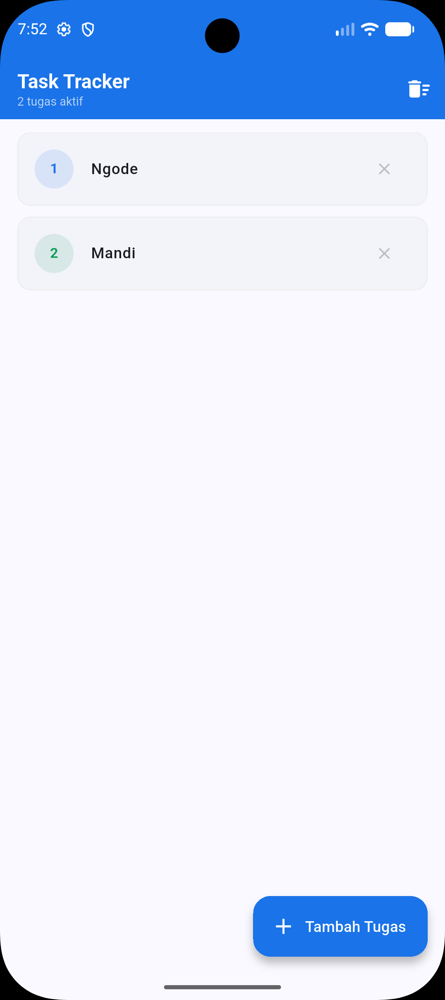
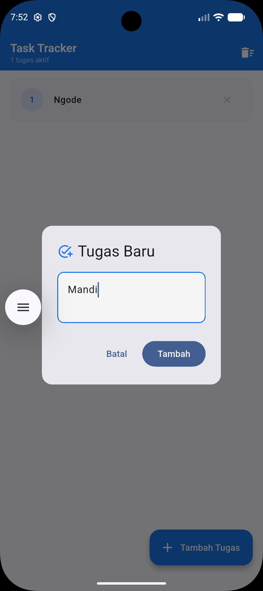
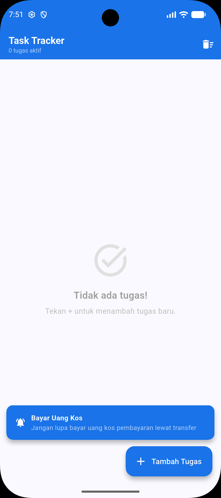
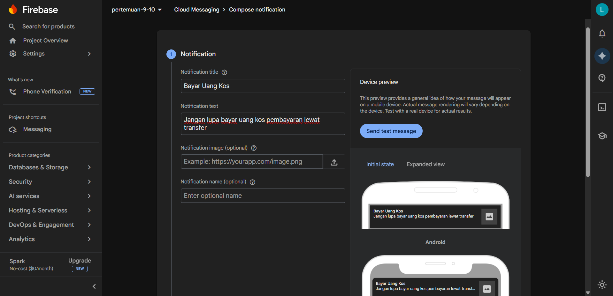

# 📋 Task Tracker

<p align="center">
  Aplikasi manajemen tugas berbasis Flutter yang mengimplementasikan <b>Provider</b> untuk State Management reaktif dan <b>Firebase Cloud Messaging (FCM)</b> untuk push notification realtime. Dibangun dengan desain <i>light mode</i> bersih menggunakan palet warna biru profesional.
</p>

<p align="center">
  
  
  
  
  
</p>

---

## 📋 Deskripsi Proyek

**Task Tracker** adalah aplikasi manajemen tugas yang dikembangkan menggunakan framework Flutter dengan pendekatan *single-file architecture*. Aplikasi ini mendemonstrasikan dua konsep utama pengembangan mobile modern: (1) pengelolaan state reaktif menggunakan library **Provider** berbasis pola `ChangeNotifier`, dan (2) integrasi layanan push notification realtime menggunakan **Firebase Cloud Messaging (FCM)**.

Seluruh logika state terpusat pada class `TaskProvider` yang menyimpan daftar tugas sebagai `List<Map>`. Perubahan pada state—baik penambahan maupun penghapusan tugas—dipropagasi secara otomatis ke seluruh widget yang menggunakan `Consumer<TaskProvider>` tanpa perlu melakukan `setState` secara manual. Notifikasi FCM ditangani di tiga skenario: foreground (SnackBar), background, dan terminated.

---

## ✨ Fitur Utama

- **Daftar Tugas Reaktif** — `ListView.builder` dibungkus `Consumer<TaskProvider>` yang otomatis rebuild saat state berubah tanpa `setState` manual.
- **Tambah Tugas Baru** — `FloatingActionButton` memunculkan `AlertDialog` dengan `TextField` autofocus untuk menginput deskripsi tugas.
- **Hapus Satu Tugas** — Tombol × per kartu memanggil `removeTask(id)` pada `TaskProvider`.
- **Hapus Semua Tugas** — Ikon tempat sampah di `AppBar` memanggil `clearAll()` dengan konfirmasi dialog terlebih dahulu.
- **FCM Foreground** — `SnackBar` floating berwarna biru muncul saat notifikasi push diterima ketika aplikasi sedang terbuka.
- **FCM Background & Terminated** — Background handler top-level menangkap notifikasi saat aplikasi diminimize atau tertutup.
- **FCM Token** — Token perangkat dicetak di debug console saat aplikasi pertama kali dijalankan, siap disalin untuk pengujian.
- **Counter Tugas Reaktif** — Subtitle AppBar menampilkan jumlah tugas aktif yang diperbarui secara otomatis.

---

## 🗂️ Struktur Repositori

```
pertemuan_9_10/
├── lib/
│   ├── main.dart              # Source code utama aplikasi (single-file)
│   └── firebase_options.dart  # Konfigurasi Firebase (auto-generated oleh FlutterFire CLI)
├── android/
│   └── app/
│       ├── google-services.json   # Konfigurasi Firebase Android
│       └── build.gradle           # Konfigurasi build Android
├── output/
│   ├── home.png               # Screenshot tampilan daftar tugas
│   ├── create.png             # Screenshot dialog tambah tugas
│   ├── show.png               # Screenshot notifikasi FCM foreground
│   └── firebase.png           # Screenshot Firebase Console pengiriman notifikasi
├── pubspec.yaml               # Konfigurasi dependensi proyek
└── README.md                  # Dokumentasi proyek ini
```

> **Keterangan:**
> - `lib/main.dart` — Berisi seluruh logika bisnis, state management, FCM handler, dan komponen UI dalam satu file.
> - `lib/firebase_options.dart` — Dibuat otomatis oleh `flutterfire configure`, berisi konfigurasi Firebase per platform.
> - `output/` — Berisi tangkapan layar hasil pengujian aplikasi pada perangkat fisik/emulator.

---

## 🧩 Penjelasan Widget & Arsitektur

### Model Data & State Management

| Kelas / Widget | Tipe | Deskripsi |
|---|---|---|
| `TaskProvider` | `ChangeNotifier` | Inti state management aplikasi. Menyimpan `List<Map<String, dynamic>>` sebagai daftar tugas. Menyediakan metode `addTask()`, `removeTask(id)`, dan `clearAll()`, masing-masing mengakhiri eksekusi dengan `notifyListeners()` untuk memicu rebuild pada semua `Consumer` yang terdaftar. |
| `TaskTrackerApp` | `StatelessWidget` | Widget akar (*root widget*) yang mengonfigurasi `MaterialApp` secara menyeluruh, termasuk `ThemeData`, `ColorScheme.fromSeed`, dan penetapan `home` ke `TaskListScreen`. Juga menjadi titik injeksi `ChangeNotifierProvider`. |
| `TaskListScreen` | `StatefulWidget` | Halaman utama aplikasi. Mendaftarkan listener FCM foreground (`FirebaseMessaging.onMessage.listen`) di `initState()` dan `dispose` controller di `dispose()`. Mengelola `TextEditingController` untuk input dialog. |
| `_TaskCard` | `StatelessWidget` | Widget kartu per tugas dengan `CircleAvatar` nomor urut berwarna berputar (biru/hijau/kuning), teks judul, dan tombol hapus. Menerima `onDelete` callback yang memanggil `removeTask(id)` pada provider. |

### Fungsi FCM (Top-Level)

| Fungsi | Deskripsi |
|---|---|
| `_firebaseMessagingBackgroundHandler()` | Dideklarasi sebagai **top-level function** (wajib, bukan method di dalam class) agar dapat dieksekusi oleh FCM SDK di Flutter Isolate terpisah. Dipanggil saat notifikasi masuk ketika aplikasi berada di background atau terminated. |
| `initFCM()` | Dipanggil sekali dari `main()`. Bertugas: (1) meminta izin notifikasi via `requestPermission()`, (2) mengambil dan mencetak FCM Token, (3) mendaftarkan listener `onTokenRefresh`, (4) mendaftarkan background handler. |

### Widget UI Bawaan Flutter yang Krusial

| Widget | Deskripsi Peran dalam Aplikasi |
|---|---|
| `ChangeNotifierProvider` | Membungkus seluruh widget tree di `runApp()`. Menginjeksikan instance `TaskProvider` ke semua widget di bawahnya sehingga dapat diakses via `context.read<TaskProvider>()` atau `Consumer`. |
| `Consumer<TaskProvider>` | Mendengarkan perubahan pada `TaskProvider` dan me-rebuild hanya subtree yang dilingkupinya setiap kali `notifyListeners()` dipanggil. Digunakan di `AppBar` (counter) dan `body` (ListView). |
| `ListView.builder` | Merender daftar tugas secara efisien — hanya item yang terlihat di layar yang dibangun. `itemCount` dan `itemBuilder` mengambil data langsung dari `provider.tasks` melalui `Consumer`. |
| `FloatingActionButton.extended` | Tombol aksi mengambang di pojok kanan bawah yang membuka `AlertDialog` input tugas baru. Menggunakan label teks "Tambah Tugas" untuk kejelasan fungsi. |
| `AlertDialog` | Digunakan dalam dua konteks: (1) dialog input tugas baru dengan `TextField`, tombol "Batal" dan "Tambah"; (2) dialog konfirmasi *Clear All* dengan tombol "Hapus Semua" berwarna merah. |
| `ScaffoldMessenger` + `SnackBar` | Menampilkan notifikasi FCM foreground sebagai `SnackBar` floating berwarna biru (`#1A73E8`) dengan ikon lonceng, judul tebal, dan teks body — seluruhnya diambil dari objek `RemoteMessage.notification`. |
| `TextEditingController` | Mengelola input teks pada `TextField` di dalam `AlertDialog` penambahan tugas. Di-dispose di `dispose()` untuk mencegah memory leak. |

---

## 📸 Tampilan Output

<table align="center">
  <tr>
    <td align="center"><b>Daftar Tugas</b><br></td>
    <td align="center"><b>Tambah Tugas</b><br></td>
    <td align="center"><b>Notifikasi FCM</b><br></td>
  </tr>
</table>

<p align="center">
  <br>
  <sub><i>Firebase Console — Compose Notification pada project pertemuan-9-10</i></sub>
</p>

---

## 🛠️ Prasyarat

Pastikan lingkungan pengembangan telah terpasang dan terkonfigurasi dengan benar:

- [Flutter SDK](https://docs.flutter.dev/get-started/install) versi **3.x** atau lebih baru
- [Dart SDK](https://dart.dev/get-dart) versi **3.x** (sudah termasuk dalam Flutter SDK)
- Android Studio / VS Code dengan ekstensi Flutter & Dart
- Akun [Firebase](https://console.firebase.google.com) aktif
- Perangkat fisik Android atau emulator (API Level 21+)
- Node.js (untuk Firebase CLI)

---

## ⚙️ Konfigurasi Android

Pastikan `android/app/build.gradle` memiliki `minSdkVersion` minimal 21:

```gradle
defaultConfig {
    minSdkVersion 21
    targetSdkVersion 34
}
```

Tambahkan plugin Google Services di paling bawah `android/app/build.gradle`:

```gradle
apply plugin: 'com.google.gms.google-services'
```

Tambahkan classpath di `android/build.gradle` (project-level):

```gradle
buildscript {
    dependencies {
        classpath 'com.google.gms:google-services:4.4.2'
    }
}
```

Tambahkan permission di `android/app/src/main/AndroidManifest.xml`:

```xml
<uses-permission android:name="android.permission.INTERNET"/>
<uses-permission android:name="android.permission.RECEIVE_BOOT_COMPLETED"/>
```

---

## 🚀 Cara Menjalankan

**1. Clone repositori**
```bash
git clone https://github.com/lauraneval/2311102078_praktikum_abp_02.git
cd pertemuan_9_10
```

**2. Install seluruh dependensi**
```bash
flutter pub get
```

**3. Setup Firebase (jika belum)**
```bash
# Install Firebase CLI
npm install -g firebase-tools
firebase login

# Install & jalankan FlutterFire CLI
dart pub global activate flutterfire_cli
flutterfire configure
```

> FlutterFire CLI akan otomatis menghasilkan `lib/firebase_options.dart` dan mengonfigurasi `build.gradle`.

**4. Jalankan aplikasi**
```bash
flutter run
```

**5. Salin FCM Token dari debug console**
```
━━━━━━━━━━━━━━━━━━━━━━━━━━━━━━━━━━━━━━━━
🔑 FCM TOKEN (salin dari sini):
your_fcm_token_here...
━━━━━━━━━━━━━━━━━━━━━━━━━━━━━━━━━━━━━━━━
```

**6. Uji notifikasi via Firebase Console**

Buka [Firebase Console](https://console.firebase.google.com) → **Messaging** → **Send test message** → paste token → **Test**.

---

## 📦 Dependensi

| Package | Versi | Fungsi |
|---|---|---|
| `provider` | `^6.1.2` | State management reaktif berbasis `ChangeNotifier` |
| `firebase_core` | `^3.x` | Inisialisasi Firebase SDK untuk Flutter |
| `firebase_messaging` | `^15.x` | Push notification via Firebase Cloud Messaging |

---

## 💡 Konsep Utama

### Alur State Management (Provider)

```
User Action (tap FAB)
    ↓
_showAddTaskDialog()        → AlertDialog muncul
    ↓
context.read<TaskProvider>().addTask(text)
    ↓
TaskProvider._tasks.add(...)
    ↓
notifyListeners()
    ↓
Consumer<TaskProvider> rebuild
    ↓
ListView.builder re-render dengan item baru
```

### Alur FCM (3 Skenario)

| Skenario | Kondisi App | Handler | Output |
|---|---|---|---|
| **Foreground** | App terbuka | `onMessage.listen` di `initState()` | `SnackBar` biru di layar |
| **Background** | App diminimize | `onBackgroundMessage` (top-level) | Notifikasi tray sistem |
| **Terminated** | App tertutup | Ditangani otomatis FCM SDK | Notifikasi tray sistem |

---

## 📄 Lisensi

Proyek ini dibuat untuk keperluan akademis dalam rangka memenuhi tugas Praktikum Aplikasi Berbasis Platform. Seluruh source code dalam repositori ini bersifat terbuka dan bebas digunakan sebagai referensi pembelajaran.

---

<div align="center">
  <sub>Dibuat dengan ❤️ by Lauraneval · 2026</sub>
</div>